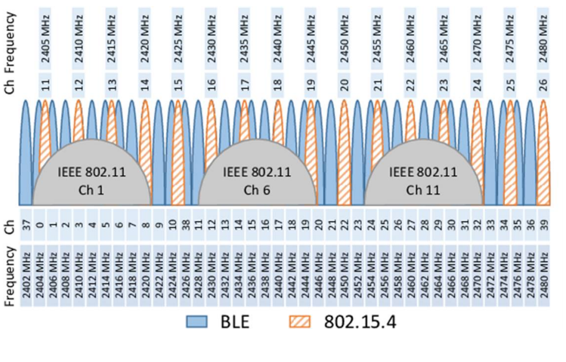

# channel-sensing #

IEEE 802.15.4 uses ISM band 2.4 GHz radio frequencies(from channel 11 to channel 26) to transmit sensor
data. These frequency are also used by other radio technologies, such as WiFi, Bluetooth, and others. To
setup a WSN, it is an important step to select a channel with minimum interference. A practical approach
is to leverage channel sensing to identify the channel inference status by measuring the
noise/interference signal strength

## Tasks
1. Write a program to measure the noise/inference signal strength of different channel (from channel
11 to channel 26)
2. Learn how to set up the channel 
3. To measure RSSI of the noise/interference at different channels. You should decide how long to
measure the RSSI value and how to deal with the measures in each channel. Please refer to the
datasheet CC2420 about how to convert the RSSI register value to the RSSI value in dBm
[CC2420 Datasheet](https://www.ti.com/product/CC2420)

### Task1 - Measure the noise/inference signal strength of different channel
To measure the measure the noise/inference signal strength of different channel we wil use the "CC2420.h" module. From the module we will use the following functions
*  cc2420_init()            
    * init the cc2420 driver module
*  cc2420_on();
    * Turns on radio
*  c2420_set_channel(channel);
    * Selects channel [11-26]
*  cc2420_rssi();              
    * Get RSSI in dBm - The follwing convertion from the datasheet to get it in dBm is used: rssi_dBm = RSSI_VALUE + RSSI_OFFSET (can be seen in implementation file "CC2420.c)
    * The RSSI value is always averaged over 8 symbol periods (128 μs)
Even tho cc2420_rssi() meassures over 8 symbol periods (128 μs), it only gives the signal indicater within that very short time. Instead it is decided to average 10 samples from cc2420_rssi() over at time period of 1 seconds (100 ms/128 clock ticks) between each sample, and average it. In the code the radio is turned on as little as possible, in order to save energy.
