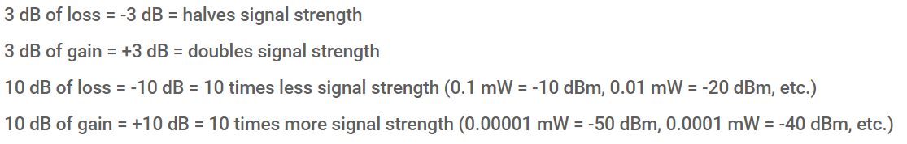
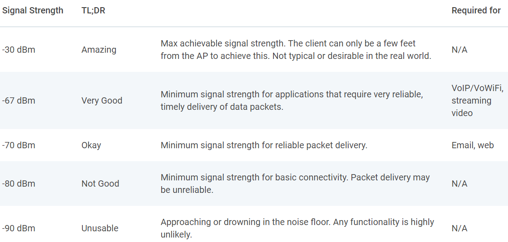

# channel-sensing #

IEEE 802.15.4 uses ISM band 2.4 GHz radio frequencies(from channel 11 to channel 26) to transmit sensor
data. These frequency are also used by other radio technologies, such as WiFi, Bluetooth, and others. To
setup a WSN, it is an important step to select a channel with minimum interference. A practical approach
is to leverage channel sensing to identify the channel inference status by measuring the
noise/interference signal strength

## Tasks
1. Write a program to measure the noise/inference signal strength of different channel (from channel
11 to channel 26)
2. Learn how to set up the channel 
3. To measure RSSI of the noise/interference at different channels. You should decide how long to
measure the RSSI value and how to deal with the measures in each channel. Please refer to the
datasheet CC2420 about how to convert the RSSI register value to the RSSI value in dBm
[CC2420 Datasheet](https://www.ti.com/product/CC2420)


### Measure the noise/inference signal strength of different channel
To measure the measure the noise/inference signal strength of different channel we wil use the "CC2420.h" module. From the module we will use the following functions
*  cc2420_init()            
    * init the cc2420 driver module
*  cc2420_on();
    * Turns on radio
*  c2420_set_channel(channel);
    * Selects channel [11-26]
*  cc2420_rssi();              
    * Get RSSI in dBm - The follwing convertion from the datasheet to get it in dBm is used: rssi_dBm = RSSI_VALUE + RSSI_OFFSET (can be seen in implementation file "CC2420.c)
    * The RSSI value is always averaged over 8 symbol periods (128 μs)
Even tho cc2420_rssi() meassures over 8 symbol periods (128 μs), it only gives the signal indicater within that very short time. Instead it is decided to average 10 samples from cc2420_rssi() over at time period of 1 seconds (100 ms/128 clock ticks) between each sample, and average it. In the code the radio is turned on as little as possible, in order to save energy.

### Task 3 - Select best channel

*What is a good dBm* (ref https://www.metageek.com/training/resources/wifi-signal-strength-basics.html)
dBm is meassured logarithmic, which means the scaling implies differently:




The follwing output is meassured from the Telos B mote:
```
connecting to /dev/ttyUSB0 [OK]
RSSI Measurement : selected channel 11 
RSSI Measurement : channel 11 Averege RSSI dBm -87 
RSSI Measurement : selected channel 12
RSSI Measurement : channel 12 Averege RSSI dBm -88 
RSSI Measurement : selected channel 13
RSSI Measurement : channel 13 Averege RSSI dBm -84 
RSSI Measurement : selected channel 14
RSSI Measurement : channel 14 Averege RSSI dBm -78
RSSI Measurement : selected channel 15
RSSI Measurement : channel 15 Averege RSSI dBm -85
RSSI Measurement : selected channel 16
RSSI Measurement : channel 16 Averege RSSI dBm -86
RSSI Measurement : selected channel 17
RSSI Measurement : channel 17 Averege RSSI dBm -87
RSSI Measurement : selected channel 18
RSSI Measurement : channel 18 Averege RSSI dBm -86
RSSI Measurement : selected channel 19
RSSI Measurement : channel 19 Averege RSSI dBm -86
RSSI Measurement : selected channel 20
RSSI Measurement : channel 20 Averege RSSI dBm -86
RSSI Measurement : selected channel 21
RSSI Measurement : channel 21 Averege RSSI dBm -84
RSSI Measurement : selected channel 22
RSSI Measurement : channel 22 Averege RSSI dBm -85
RSSI Measurement : selected channel 23
RSSI Measurement : channel 23 Averege RSSI dBm -84
RSSI Measurement : selected channel 24
RSSI Measurement : channel 24 Averege RSSI dBm -84
RSSI Measurement : selected channel 25 
RSSI Measurement : channel 25 Averege RSSI dBm -85
RSSI Measurement : selected channel 26 
RSSI Measurement : channel 26 Averege RSSI dBm -86
RSSI Measurement : Best channel = 14 
[DBG : Sensing Log] Main finish 
```
The algorithm selects the highest dBm meassured, to select channel **RSSI Measurement : Best channel = 14 **


